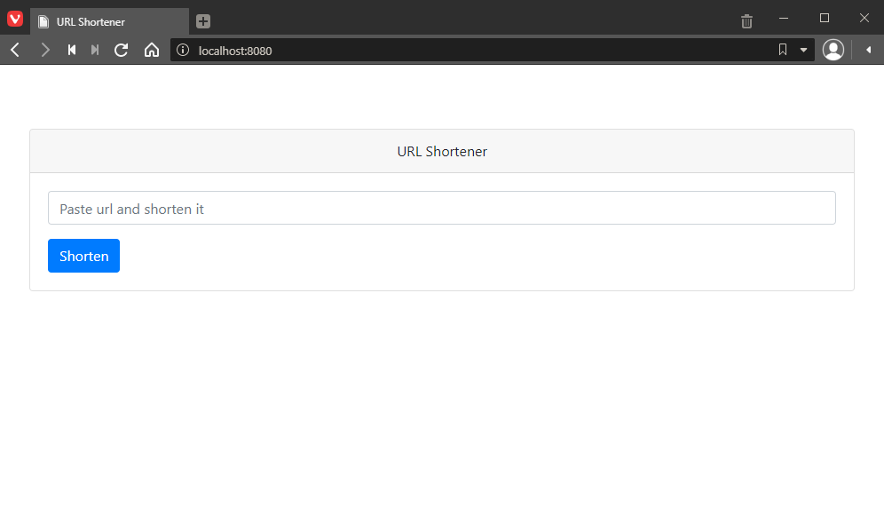

# URL-Shortener
A simple web-service for shortening URL written in Java using JAX-RS, Maven and MongoDB.

Links have an expiration date, after which they are automatically deleted from the database. The number of clicks on the link is also counted.
 
 

